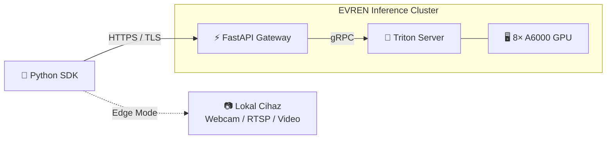
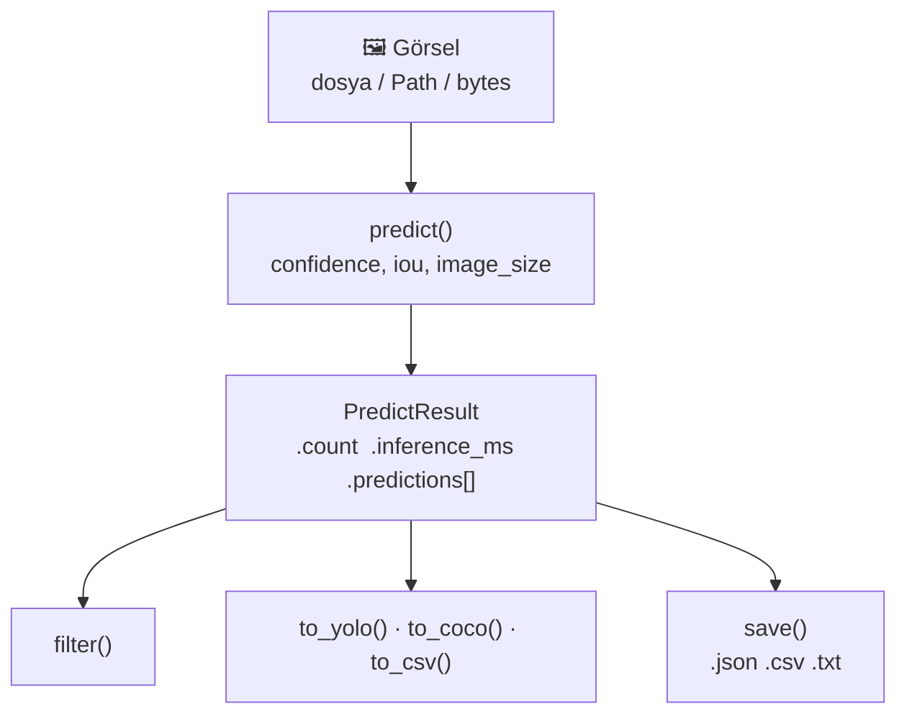
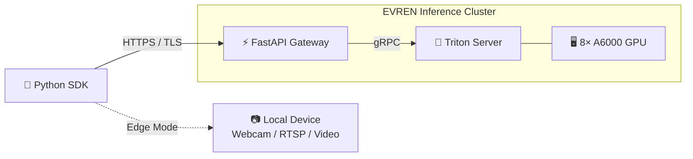
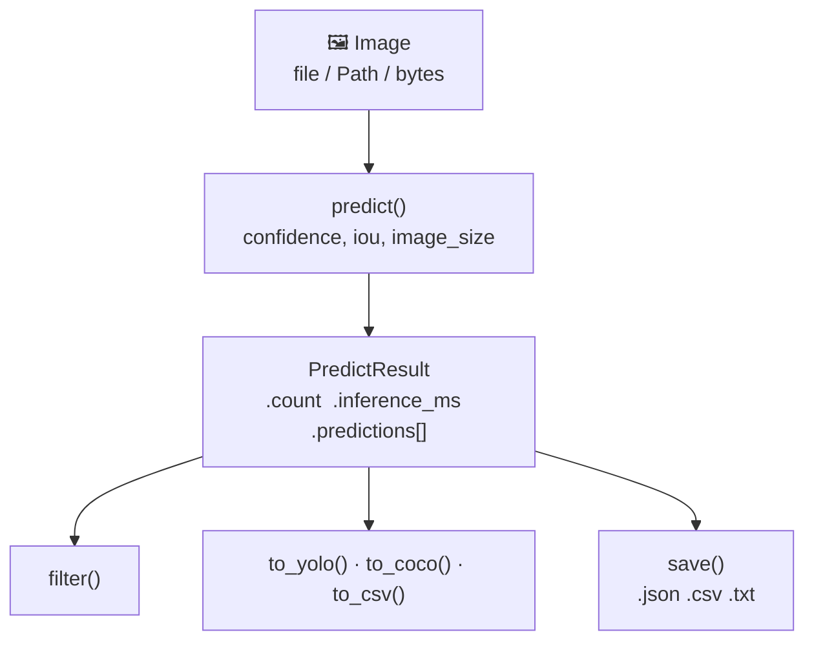

<p align="center">
  
</p>

<h1 align="center">evren-sdk</h1>

<p align="center">
  <strong>EVREN MLOps Platform — Official Python SDK</strong>
</p>

<p align="center">
  <a href="https://pypi.org/project/evren-sdk/"></a>
  <a href="https://pypi.org/project/evren-sdk/"></a>
  <a href="https://github.com/speker/evren-sdk/blob/main/LICENSE"></a>
  <a href="https://github.com/speker/evren-sdk/actions"></a>
  
</p>

<p align="center">
  <a href="#-türkçe">Türkçe</a> · <a href="#-english">English</a> · <a href="examples/">Examples</a> · <a href="CHANGELOG.md">Changelog</a>
</p>

---

<br/>

## 🇹🇷 Türkçe

EVREN platformu üzerinde eğitilmiş bilgisayarlı görü modellerine Python'dan çıkarım yapmanızı sağlayan resmi SDK.

**Nesne tespiti** · **Sınıflandırma** · **Segmentasyon** · **OBB** · **Keypoint** · **Edge Inference**

<br/>

### Mimari



Tek bir `predict()` cagrisi arkasinda 8× NVIDIA A6000 GPU calisiyor.
Kullanici altyapi yonetmez — `pip install` ve 3 satir kod yeter.

### Kurulum

```bash
pip install evren-sdk            # temel SDK
pip install evren-sdk[edge]      # + OpenCV (kamera/video)
```

### Hızlı Başlangıç

```python
from evren_sdk import EvrenClient

client = EvrenClient(api_key="evren_xxxxx")
result = client.predict("kullanici/model-adi", "foto.jpg", confidence=0.3)

for det in result.predictions:
    print(f"{det.class_name}: {det.confidence:.0%}  bbox={det.bbox}")
```

Daha fazla ornek icin [`examples/`](examples/) dizinine bakin.

### Kimlik Doğrulama

Platformda **Ayarlar → API Anahtarları** sayfasından anahtar oluşturun.
Anahtar `evren_` ön eki ile başlar.

```python
client = EvrenClient(api_key="evren_xxxxx")    # API anahtarı (önerilen)
client = EvrenClient(api_key="eyJhbGci...")    # JWT token
```

### Çıkarım Akışı



### Tekil Çıkarım

```python
result = client.predict(
    model="kullanici/model-adi",        # slug, slug:tag veya UUID
    image="resim.jpg",                  # dosya yolu, Path veya bytes
    confidence=0.25,
    iou=0.45,
    image_size=640,
    classes=["araba", "insan"],         # isteğe bağlı
)
```

| `model` Formatı | Açıklama |
|---|---|
| `"owner/slug"` | Son versiyonu otomatik çözer |
| `"owner/slug:v2.0"` | Belirli versiyon etiketi |
| `"019cec..."` (UUID) | Doğrudan versiyon ID |

### Toplu Çıkarım (Batch)

```python
batch = client.predict_batch(
    model="kullanici/model-adi",
    images=["img1.jpg", "img2.jpg", "img3.jpg"],
    confidence=0.3,
)

for r in batch:
    print(f"{r.count} tespit, {r.inference_ms:.0f} ms")
```

Bkz. [`examples/02_batch_inference.py`](examples/02_batch_inference.py)

### Sonuç İşleme & Export

```python
result = client.predict("kullanici/model", "sahne.jpg")

# filtrele
filtre = result.filter(min_confidence=0.5, classes=["araba"])

# export
result.to_yolo()          # YOLO txt format
result.to_coco()          # COCO dict list
result.to_csv()           # CSV string

# dosyaya kaydet (format uzantıdan anlaşılır)
result.save("sonuc.json")
result.save("sonuc.csv")
result.save("labels.txt")
```

Detay: [`examples/03_result_export.py`](examples/03_result_export.py)

### Model Bilgileri & Warmup

```python
# sınıfları listele
info = client.model_classes("kullanici/model-adi")
for cls in info.classes:
    print(f"  {cls.name}: {cls.color}")

# mevcut modelleri listele
for m in client.list_models():
    print(f"{m.full_slug} — {m.architecture}")

# GPU'ya ön-yükleme (cold-start elimine)
client.warmup(["kullanici/model-adi"])
```

### Performans Testi

```python
bench = client.benchmark("kullanici/model", "test.jpg", rounds=20)

print(f"Avg: {bench.avg_ms:.1f}ms  |  p95: {bench.p95_ms:.1f}ms")
print(f"Min: {bench.min_ms:.1f}ms  |  Max: {bench.max_ms:.1f}ms")
print(f"Throughput: {bench.throughput_fps:.1f} FPS")
```

→ [`examples/04_benchmark.py`](examples/04_benchmark.py)

### Model İndirme

```python
path = client.download_model("kullanici/model", output="weights/", fmt="onnx")
print(f"Kaydedildi: {path}")   # weights/best.onnx
```

### Veri Setine Görsel Yükleme

SDK üzerinden doğrudan bir veri setine görsel yükleyebilirsiniz.

```python
resp = client.upload_to_dataset(dataset_id="<UUID>", image="yeni_gorsel.jpg")
```

### Asenkron Kullanım

```python
import asyncio
from evren_sdk import AsyncEvrenClient

async def main():
    async with AsyncEvrenClient(api_key="evren_xxxxx") as client:
        result = await client.predict("kullanici/model", "foto.jpg")
        batch  = await client.predict_batch("kullanici/model", ["a.jpg", "b.jpg"])

asyncio.run(main())
```

Paralel pipeline icin [`examples/07_async_pipeline.py`](examples/07_async_pipeline.py)

### Edge Modu (GPU'suz Cihazlar)

GPU olmayan cihazlarda (Raspberry Pi, laptop, endüstriyel PC) gerçek zamanlı
çıkarım. Çıkarım EVREN GPU'larında çalışır — lokal deneyim hissi verir.


```bash
pip install evren-sdk[edge]
```

```python
from evren_sdk import EvrenCamera

cam = EvrenCamera("evren_...", "kullanici/model", confidence=0.3)

cam.run(0)                                      # webcam, ESC ile kapat
cam.record("input.mp4", "output.mp4")           # video isle + kaydet

for frame, result in cam.stream(0):             # kendi loop'unuz
    print(f"{result.count} tespit")

for path, result in cam.scan("images/"):        # klasör tarama
    print(f"{path.name}: {result.count} nesne")
```

| Parametre | Varsayılan | Açıklama |
|---|---|---|
| `max_fps` | `15.0` | Bant genişliği koruma limiti |
| `jpeg_quality` | `70` | Sıkıştırma kalitesi (20-95) |
| `draw` | `True` | Tahminleri frame üzerine çiz |
| `confidence` | `0.25` | Minimum güven eşiği |

Bkz. [`examples/05_edge_camera.py`](examples/05_edge_camera.py)

### Hata Yönetimi

```python
from evren_sdk import (
    EvrenClient, InsufficientCreditsError,
    NotFoundError, RateLimitError, InferenceError,
)

client = EvrenClient(api_key="evren_xxxxx")

try:
    result = client.predict("kullanici/model", "test.jpg")
except InsufficientCreditsError as e:
    print(f"Kredi yetersiz — gerekli: {e.required}, bakiye: {e.available}")
except NotFoundError:
    print("Model bulunamadı")
except RateLimitError as e:
    time.sleep(e.retry_after)
except InferenceError:
    print("GPU sunucusu geçici olarak kullanılamıyor")
```

| Exception | HTTP | Açıklama |
|---|---|---|
| `AuthenticationError` | 401, 403 | Geçersiz veya süresi dolmuş anahtar |
| `InsufficientCreditsError` | 402 | Kredi bakiyesi yetersiz |
| `NotFoundError` | 404 | Model veya versiyon bulunamadı |
| `ValidationError` | 422 | Hatalı parametre |
| `RateLimitError` | 429 | İstek limiti aşıldı |
| `InferenceError` | 502, 503 | GPU sunucusu hatası |

> Her çıkarım kredi tüketir. Bakiye yetersizse SDK `InsufficientCreditsError` fırlatır —
> `e.required` ve `e.available` alanları bakiye bilgisini taşır.

### API Referansı

<details>
<summary><strong>Veri Modelleri</strong></summary>

| Sınıf | Alanlar / Metotlar |
|---|---|
| `PredictResult` | `predictions`, `inference_ms`, `count`, `image_width`, `image_height` |
| ↳ metotlar | `filter()`, `to_yolo()`, `to_coco()`, `to_csv()`, `save()` |
| `Prediction` | `class_name`, `confidence`, `bbox`, `color`, `mask`, `keypoints`, `obb` |
| ↳ metotlar | `to_dict()` |
| `BatchResult` | `results`, `total_ms`, `count` — iterable, `len()` destekler |
| `BenchmarkResult` | `model`, `rounds`, `avg_ms`, `min_ms`, `max_ms`, `p95_ms`, `throughput_fps` |
| `ModelClasses` | `classes`, `architecture`, `model_name`, `total`, `imgsz` — `in` operatörü |
| ↳ metotlar | `names()` |
| `ModelInfo` | `id`, `name`, `slug`, `architecture`, `owner_username`, `full_slug` |
| `ModelVersion` | `id`, `version_tag`, `framework`, `metrics`, `weights_url` |
| `ClassInfo` | `name`, `color` |
| `EvrenCamera` | `stream()`, `run()`, `scan()`, `record()`, `stats` |

</details>

<details>
<summary><strong>Client Metotları</strong></summary>

| Metot | Açıklama |
|---|---|
| `predict(model, image, **kw)` | Tekil çıkarım |
| `predict_batch(model, images, **kw)` | GPU batch çıkarım |
| `model_classes(model)` | Model sınıfları, mimari, imgsz |
| `warmup(models)` | GPU ön-yükleme |
| `list_models(limit)` | Mevcut modelleri listele |
| `list_versions(model_id)` | Model versiyonlarını listele |
| `resolve(slug)` | Slug → version UUID çözümle |
| `benchmark(model, image, **kw)` | Performans testi |
| `download_model(model, output, fmt)` | Ağırlık dosyası indir |
| `upload_to_dataset(dataset_id, image)` | Veri setine görsel yükle |

`AsyncEvrenClient` aynı API'yi `async/await` ile sunar.

</details>

---

## 🇬🇧 English

Official Python SDK for running inference on computer vision models trained on
the EVREN platform.

**Object Detection** · **Classification** · **Segmentation** · **OBB** · **Keypoint** · **Edge Inference**

### Architecture



A single `predict()` call leverages 8× NVIDIA A6000 GPUs.
No infrastructure management — `pip install` and 3 lines of code.

### Installation

```bash
pip install evren-sdk            # core SDK
pip install evren-sdk[edge]      # + OpenCV (camera/video support)
```

### Quick Start

```python
from evren_sdk import EvrenClient

client = EvrenClient(api_key="evren_xxxxx")
result = client.predict("owner/model-name", "photo.jpg", confidence=0.3)

for det in result.predictions:
    print(f"{det.class_name}: {det.confidence:.0%}  bbox={det.bbox}")
```

See [`examples/`](examples/) for runnable scripts covering every feature.

### Authentication

Create an API key from **Settings → API Keys** on the platform.
Keys start with the `evren_` prefix.

```python
client = EvrenClient(api_key="evren_xxxxx")    # API key (recommended)
client = EvrenClient(api_key="eyJhbGci...")    # JWT token
```

### Inference Pipeline



### Single Prediction

```python
result = client.predict(
    model="owner/model-name",           # slug, slug:tag, or UUID
    image="image.jpg",                  # file path, Path, or bytes
    confidence=0.25,
    iou=0.45,
    image_size=640,
    classes=["car", "person"],          # optional
)
```

| `model` Format | Description |
|---|---|
| `"owner/slug"` | Resolves to latest version |
| `"owner/slug:v2.0"` | Specific version tag |
| `"019cec..."` (UUID) | Direct version ID |

### Batch Prediction

```python
batch = client.predict_batch(
    model="owner/model-name",
    images=["img1.jpg", "img2.jpg", "img3.jpg"],
    confidence=0.3,
)

for r in batch:
    print(f"{r.count} detections, {r.inference_ms:.0f} ms")
```

See [`examples/02_batch_inference.py`](examples/02_batch_inference.py)

### Result Processing & Export

```python
result = client.predict("owner/model", "scene.jpg")

filtered = result.filter(min_confidence=0.5, classes=["car"])

result.to_yolo()          # YOLO txt
result.to_coco()          # COCO dict list
result.to_csv()           # CSV string

result.save("result.json")
result.save("result.csv")
result.save("labels.txt")
```

Full example: [`examples/03_result_export.py`](examples/03_result_export.py)

### Model Info & Warmup

```python
info = client.model_classes("owner/model-name")
for cls in info.classes:
    print(f"  {cls.name}: {cls.color}")

for m in client.list_models():
    print(f"{m.full_slug} — {m.architecture}")

client.warmup(["owner/model-name"])   # eliminate cold-start
```

### Benchmarking

```python
bench = client.benchmark("owner/model", "test.jpg", rounds=20)

print(f"Avg: {bench.avg_ms:.1f}ms  |  p95: {bench.p95_ms:.1f}ms")
print(f"Throughput: {bench.throughput_fps:.1f} FPS")
```

→ [`examples/04_benchmark.py`](examples/04_benchmark.py)

### Model Download

```python
path = client.download_model("owner/model", output="weights/", fmt="onnx")
print(f"Saved to: {path}")   # weights/best.onnx
```

### Upload to Dataset

Upload images to a dataset directly from the SDK.

```python
resp = client.upload_to_dataset(dataset_id="<UUID>", image="new_image.jpg")
```

### Async Usage

```python
import asyncio
from evren_sdk import AsyncEvrenClient

async def main():
    async with AsyncEvrenClient(api_key="evren_xxxxx") as client:
        result = await client.predict("owner/model", "photo.jpg")
        batch  = await client.predict_batch("owner/model", ["a.jpg", "b.jpg"])

asyncio.run(main())
```

Parallel pipeline: [`examples/07_async_pipeline.py`](examples/07_async_pipeline.py)

### Edge Mode (GPU-free Devices)

Real-time inference on devices without a GPU (Raspberry Pi, laptops,
industrial PCs). Inference runs on EVREN cloud GPUs — the UX feels local.


```bash
pip install evren-sdk[edge]
```

```python
from evren_sdk import EvrenCamera

cam = EvrenCamera("evren_...", "owner/model", confidence=0.3)

cam.run(0)                                      # webcam, ESC to quit
cam.record("input.mp4", "output.mp4")           # process + save
for frame, result in cam.stream(0):             # custom loop
    print(f"{result.count} detections")
for path, result in cam.scan("images/"):        # folder scan
    print(f"{path.name}: {result.count} objects")
```

| Parameter | Default | Description |
|---|---|---|
| `max_fps` | `15.0` | FPS cap to conserve bandwidth |
| `jpeg_quality` | `70` | JPEG compression quality (20-95) |
| `draw` | `True` | Render predictions on frame |
| `confidence` | `0.25` | Minimum confidence threshold |

→ [`examples/05_edge_camera.py`](examples/05_edge_camera.py)

### Error Handling

```python
from evren_sdk import (
    EvrenClient, InsufficientCreditsError,
    NotFoundError, RateLimitError, InferenceError,
)

try:
    result = client.predict("owner/model", "test.jpg")
except InsufficientCreditsError as e:
    print(f"Not enough credits — need: {e.required}, have: {e.available}")
except NotFoundError:
    print("Model not found")
except RateLimitError as e:
    time.sleep(e.retry_after)
except InferenceError:
    print("GPU server temporarily unavailable")
```

| Exception | HTTP | Description |
|---|---|---|
| `AuthenticationError` | 401, 403 | Invalid or expired key |
| `InsufficientCreditsError` | 402 | Insufficient credits |
| `NotFoundError` | 404 | Model or version not found |
| `ValidationError` | 422 | Invalid parameter |
| `RateLimitError` | 429 | Rate limit exceeded |
| `InferenceError` | 502, 503 | GPU server error |

> Every inference call consumes credits. When balance is too low, the SDK raises
> `InsufficientCreditsError` with `e.required` and `e.available` fields.

### API Reference

<details>
<summary><strong>Data Models</strong></summary>

| Class | Fields / Methods |
|---|---|
| `PredictResult` | `predictions`, `inference_ms`, `count`, `image_width`, `image_height` |
| ↳ methods | `filter()`, `to_yolo()`, `to_coco()`, `to_csv()`, `save()` |
| `Prediction` | `class_name`, `confidence`, `bbox`, `color`, `mask`, `keypoints`, `obb` |
| ↳ methods | `to_dict()` |
| `BatchResult` | `results`, `total_ms`, `count` — iterable, supports `len()` |
| `BenchmarkResult` | `model`, `rounds`, `avg_ms`, `min_ms`, `max_ms`, `p95_ms`, `throughput_fps` |
| `ModelClasses` | `classes`, `architecture`, `model_name`, `total`, `imgsz` — supports `in` |
| ↳ methods | `names()` |
| `ModelInfo` | `id`, `name`, `slug`, `architecture`, `owner_username`, `full_slug` |
| `ModelVersion` | `id`, `version_tag`, `framework`, `metrics`, `weights_url` |
| `ClassInfo` | `name`, `color` |
| `EvrenCamera` | `stream()`, `run()`, `scan()`, `record()`, `stats` |

</details>

<details>
<summary><strong>Client Methods</strong></summary>

| Method | Description |
|---|---|
| `predict(model, image, **kw)` | Single inference |
| `predict_batch(model, images, **kw)` | GPU batch inference |
| `model_classes(model)` | Model classes, architecture, imgsz |
| `warmup(models)` | GPU pre-load |
| `list_models(limit)` | List available models |
| `list_versions(model_id)` | List model versions |
| `resolve(slug)` | Slug → version UUID |
| `benchmark(model, image, **kw)` | Performance test |
| `download_model(model, output, fmt)` | Download weights |
| `upload_to_dataset(dataset_id, image)` | Upload image to dataset |

`AsyncEvrenClient` provides the same API with `async/await`.

</details>

---

## Examples

| # | File | Description |
|---|---|---|
| 1 | [`01_quickstart.py`](examples/01_quickstart.py) | Temel tekil çıkarım / Basic single prediction |
| 2 | [`02_batch_inference.py`](examples/02_batch_inference.py) | Toplu GPU çıkarım / Batch GPU inference |
| 3 | [`03_result_export.py`](examples/03_result_export.py) | Filtreleme & export (YOLO, COCO, CSV, JSON) |
| 4 | [`04_benchmark.py`](examples/04_benchmark.py) | Performans testi / Latency & throughput |
| 5 | [`05_edge_camera.py`](examples/05_edge_camera.py) | Edge cihaz kamera / GPU-free real-time |
| 6 | [`06_upload_to_dataset.py`](examples/06_upload_to_dataset.py) | Veri setine görsel yükleme / Upload images to dataset |
| 7 | [`07_async_pipeline.py`](examples/07_async_pipeline.py) | Asenkron paralel çıkarım / Async pipeline |

---

## Requirements

- Python >= 3.10
- [httpx](https://www.python-httpx.org/) >= 0.27
- [opencv-python](https://pypi.org/project/opencv-python/) >= 4.8 *(only for `evren-sdk[edge]`)*

## License

[Apache License 2.0](LICENSE)
